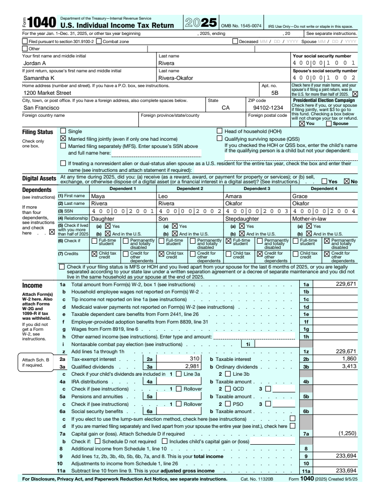
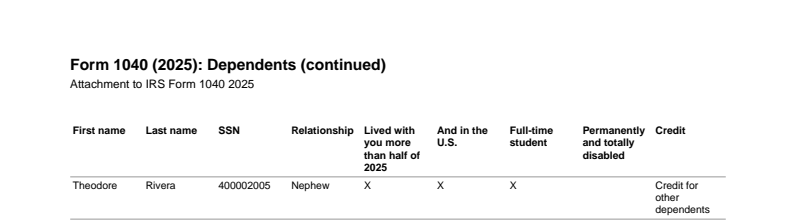
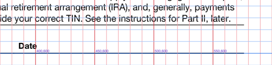
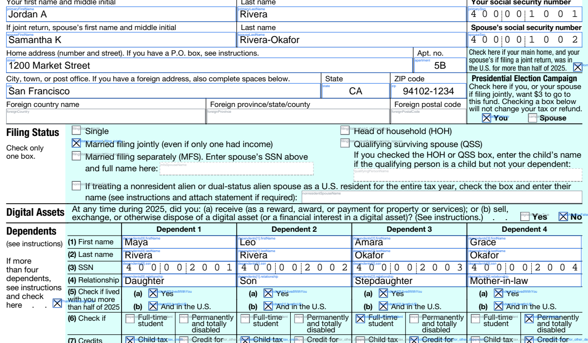

# Tax Form Annotation (TFA)

A data structure for annotating the boxes on U.S. tax forms. An annotation says where each box is, which value from a (deeply nested) data set goes in it, and how to print it. Any application can use an annotation to print a completed return on top of the official blank PDF.

This repository contains:

| | |
|---|---|
| **Specification** | [docs/SPEC.md](docs/SPEC.md): the format, the data-reference syntax, formatting, and the exact layout rules |
| **JSON Schema** | [schema/tfa.schema.json](schema/tfa.schema.json): machine-checkable definition; gives editors autocomplete and validation |
| **Typed classes** | [src/tfa/model.py](src/tfa/model.py): Python dataclasses for the whole format |
| **Reference renderer and tools** | [src/tfa](src/tfa): render, plan, explain, lint, bootstrap, grid (106 tests) |
| **Annotated forms** | the complete [2025 Form 1040](forms/irs-1040-2025/f1040.tfa.json) (all 199 boxes) and [Form W-9](forms/irs-w9-2024/fw9.tfa.json) |
| **Design notes** | [docs/DESIGN.md](docs/DESIGN.md): decisions, alternatives, future enhancements |

<p align="center"></p>

## A taste of the format

```json
{
  "id": "line2b", "type": "text", "page": 1, "label": "2b Taxable interest",
  "rect": { "x": 504, "y": 570, "width": 72, "height": 12 },
  "source": { "path": "$.documents['1099'][?@.form == 'INT'].boxes['1']", "aggregate": "sum" },
  "style": "amount"
}
```

* **Positioning:** `rect` is in PDF points, measured from the top-left of the page as displayed. It is what you see in any viewer or image tool, with no PDF-internal bottom-left flip.
* **Referencing nested data:** `source.path` is standard JSONPath (RFC 9535, restricted to the readable parts). This one selects box 1 of every 1099-INT and sums it.
* **Formatting:** the named style `amount` means right-aligned, whole dollars, IRS half-up rounding, losses in parentheses and zero left blank:

  ```json
  "amount": { "align": "right", "format": { "type": "currency", "decimals": 0, "negative": "parens", "zero": "blank" } }
  ```

Four field types cover whole forms: `text`, `checkbox` (mark when a condition holds), `choice` (e.g. filing status: mark the option equal to the value) and `repeat` (lists such as dependents, with a continuation statement when they do not fit). SSNs and EINs printed into grouped cells, dollars/cents split boxes, conditional fields and multi-line addresses are all options on these. See the [spec](docs/SPEC.md).

## Quick start

Requires Python 3.10+.

```bash
python -m venv .venv && source .venv/bin/activate
pip install -e ".[dev]"

# Print a return onto the 2025 Form 1040
tfa render forms/irs-1040-2025/f1040.tfa.json examples/data/rivera-2025.json -o out/f1040.pdf

# Same, with every box outlined and labelled (blue printed, grey empty, dashed hidden, red error)
tfa render forms/irs-1040-2025/f1040.tfa.json examples/data/rivera-2025.json -o out/debug.pdf --debug

# What would each box print? (no PDF)
tfa explain forms/irs-1040-2025/f1040.tfa.json examples/data/rivera-2025.json --printed-only

# The draw operations as JSON, for printing with your own PDF stack
tfa plan forms/irs-1040-2025/f1040.tfa.json examples/data/rivera-2025.json -o out/plan.json

# Validate annotations: schema, ids, bounds, paths, styles, overlaps, PDF checksum
tfa lint forms/*/*.tfa.json

pytest
```

Pre-rendered results are in [examples/output](examples/output). In the Rivera example, the fifth dependent does not fit the four columns of the 2025 Form 1040. The "more than four dependents" box is checked and the fifth dependent is listed on an appended statement:



Use it from code:

```python
from tfa import load_annotation, build_plan, render_pdf

annotation = load_annotation("forms/irs-1040-2025/f1040.tfa.json")
plan = build_plan(annotation, data)       # positioned text + marks + diagnostics, no PDF involved
if plan.errors:
    for d in plan.errors:
        print(d)                          # e.g. ERROR MASK_MISMATCH zip: value has 4 letters/digits ...
else:
    render_pdf(annotation, plan, "f1040.pdf")
```

`build_plan` is where all the logic lives. It returns "draw this string at (x, baseline) in this font" and "draw this mark in this box". Proprietary code can take the plan and draw it with any PDF library or on a web canvas (`tfa plan` writes it as JSON for non-Python stacks), or re-implement the spec in another language.

## Annotating a new form

1. **Download** the blank PDF next to a new annotation file. Its SHA-256 goes in `form.source.sha256`; rendering refuses any other file, so a re-issued IRS revision cannot silently misprint.
2. **Bootstrap** if the PDF is fillable (most IRS forms are):
   `tfa bootstrap form.pdf -o form.tfa.json --form-id irs-XXXX-2025`.
   This copies every widget's box, alignment and digit-cell count, and groups radio buttons into `choice` fields.
3. **Measure by hand** anything without a widget: `tfa grid form.pdf -o grid.pdf` overlays a labelled coordinate grid. The W-9 signature date was placed this way.

   
4. **Curate:** give fields meaningful ids and labels ("1a Total amount from Form(s) W-2, box 1"), point `source` at the data, and apply styles. With `"$schema"` set, VS Code autocompletes and validates as you type.
5. **Check:** run `tfa lint`, `tfa explain` and `tfa render --debug` against a sample return, and compare the result with the paper form.



## Key decisions

Details and alternatives considered are in [docs/DESIGN.md](docs/DESIGN.md).

* **JSON + JSON Schema:** language-neutral, diffable in review, and editor tooling for free.
* **Top-left points, as displayed:** the way people and image tools measure. The flip to PDF space happens once, in the renderer.
* **Pinned to the exact PDF (SHA-256):** a new form revision is a new annotation, never an edit.
* **JSONPath (RFC 9535) subset:** a standard, with wildcards and filters for list-heavy tax data. Descendant search and functions are excluded so every path says exactly where its value lives.
* **Declarative:** annotations may sum source documents (W-2 box 1 totals) but never do tax math; that belongs in the tax engine.
* **Fully specified layout:** cap-height centring, shrink-to-fit rounding and wrap rules are exact formulas, so independent implementations print identically.
* **Fail closed:** every problem is a diagnostic with a stable code and the exact field (`dependents[2].ssn`). A field with an error is never printed; a blank box beats a wrong number.
* **Print over the form, don't fill its fields:** works on non-fillable forms, avoids viewer and XFA quirks, and gives full control of formatting. Fillable fields are still harvested for their geometry.

## Future enhancements

Summarised here; see [docs/DESIGN.md](docs/DESIGN.md#future-enhancements).

* A **visual annotation editor** with live preview.
* **Box detection** for non-fillable forms.
* **Carrying annotations forward** automatically to new form revisions.
* A language-neutral **conformance suite** and **golden-image CI**.
* **Data contracts** that validate tax-engine output against the paths an annotation reads.
* **Statement headers** with the taxpayer's name and SSN.
* **Multi-page repeats.**
* **Barcodes.**

## Repository layout

```
schema/tfa.schema.json          JSON Schema for annotation files
docs/SPEC.md                    the specification
docs/DESIGN.md                  decisions, trade-offs, future work
docs/WALKTHROUGH.md             outline of the video walkthrough
forms/irs-1040-2025/            blank 2025 Form 1040 + its annotation
forms/irs-w9-2024/              blank Form W-9 (Rev. March 2024) + its annotation
examples/data/                  sample data sets (fictional)
examples/output/                filled, debug and grid PDFs, and a plan JSON, produced from them
src/tfa/                        reference implementation
  model.py                        typed classes + loader (schema-validated)
  jsonpath.py                     RFC 9535 subset: parser and evaluator
  values.py                       sources, aggregates, templates, transforms, conditions
  formatting.py                   number, currency, percent, date, mask, text
  styles.py  layout.py  fonts.py  style cascade and text placement
  plan.py                         annotation + data -> draw operations + diagnostics
  pdf.py                          draws a plan onto the blank PDF (reportlab + pypdf)
  lint.py  bootstrap.py  cli.py   tooling
tests/                          106 tests, including the coordinate contract on rotated and offset pages
```

The blank forms are official IRS PDFs from irs.gov. All people, companies and numbers in the examples are fictional.
